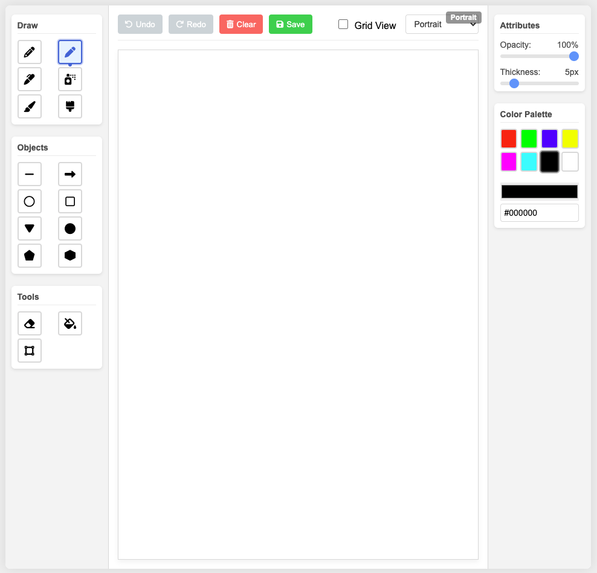

# Sketch Pad - Interactive Drawing Application

## Overview

Sketch Pad is a versatile browser-based drawing application that offers multiple drawing tools, canvas layouts, and special pixel art modes. The application enables users to create everything from freehand drawings to precise pixel art in 8-bit and 16-bit styles.



## Features

### Drawing Tools
- **Pen**: Standard drawing tool with smooth lines
- **Pencil**: Creates lighter, more textured strokes
- **Marker**: Bold strokes with slightly transparent edges
- **Spray Paint**: Creates a spray effect with varying density
- **Paint Brush**: Broader strokes for filling larger areas
- **Water Brush**: Creates gradient-like strokes with varying opacity

### Shape Tools
- **Line**: Create straight lines
- **Arrow**: Draw arrows with customizable heads
- **Circle**: Perfect circles with adjustable size
- **Rectangle**: Create rectangles and squares
- **Triangle**: Create triangular shapes
- **Oval**: Draw elliptical shapes
- **Pentagon**: Create regular pentagons
- **Hexagon**: Create regular hexagons

### Utility Tools
- **Eraser**: Remove parts of your drawing
- **Fill Bucket**: Fill enclosed areas with color
- **Marquee**: Select areas of the canvas

### Canvas Layouts
- **Portrait**: Standard A4 portrait orientation
- **Landscape**: A4 dimensions in landscape orientation
- **Two-Column**: Portrait with a center divider
- **8-bit**: Pixel art mode with 8×8 pixel sizes (like NES)
- **16-bit**: Pixel art mode with 4×4 pixel sizes (like SNES)

### Additional Features
- **Undo/Redo**: Step back or forward through your changes
- **Grid View**: Toggle gridlines for precise drawing
- **Color Picker**: Select from preset colors or choose custom colors
- **Opacity Control**: Adjust the transparency of your strokes
- **Thickness Control**: Change the width of your drawing tools
- **Save Functionality**: Export your artwork as PNG or JPEG

## How to Use

### Basic Drawing
1. Select a drawing tool from the left toolbar
2. Choose a color from the color palette on the right
3. Adjust opacity and thickness as needed
4. Draw on the canvas by clicking and dragging

### Creating Shapes
1. Select a shape tool
2. Click and drag on the canvas to define the shape's size and position
3. Release to complete the shape

### Using Pixel Art Modes
1. Select either "8-bit" or "16-bit" from the layout dropdown
2. The grid will automatically enable to show pixel boundaries
3. Draw pixel by pixel for authentic retro-style graphics
4. Note that shape tools are disabled in pixel art modes

### Undo and Redo
- Click the "Undo" button or press Ctrl+Z to undo the last action
- Click the "Redo" button or press Ctrl+Y to redo

### Saving Your Work
1. Click the "Save" button
2. Choose between PNG or JPEG format
3. The image will download to your device

## Installation

1. **Clone the Repository:**
   ```bash
   git clone https://github.com/gvnghiem/sketch-pad.git
   cd sketch-pad

No additional dependencies or installation is required. The application runs entirely in the browser.

## Browser Compatibility

Sketch Pad works best in modern browsers:
- Chrome (recommended)
- Firefox
- Safari
- Edge

## Technical Details

The application is built using vanilla JavaScript, HTML5 Canvas, and CSS. It leverages modern browser APIs for:
- Canvas manipulation
- Image data processing
- File saving

Key technical implementations include:
- Multiple canvas layers for drawing and preview
- History stack for undo/redo functionality
- Flood fill algorithm for the fill bucket tool
- Bresenham's line algorithm for pixel-perfect drawing
- Custom pixel snapping for retro graphics modes

## License

This project is licensed under the MIT License - see the LICENSE file for details.

## Acknowledgments

- Font Awesome for icon graphics
- Inspired by classic drawing applications and pixel art editors

---

Created with ♥ by Gau Nghiem 2025
